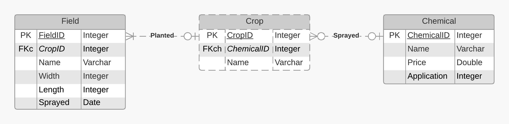

# FutureFarm Technical Test

### Assumptions
- Only the latest spray date needs to remembered
- The day first day the spray duration expires will be the expected day to reapply the chemicals

If multiple fields using the same chemical are purchased at the same time, the same batch can cover all them fields

### Entity Relationship Diagram

